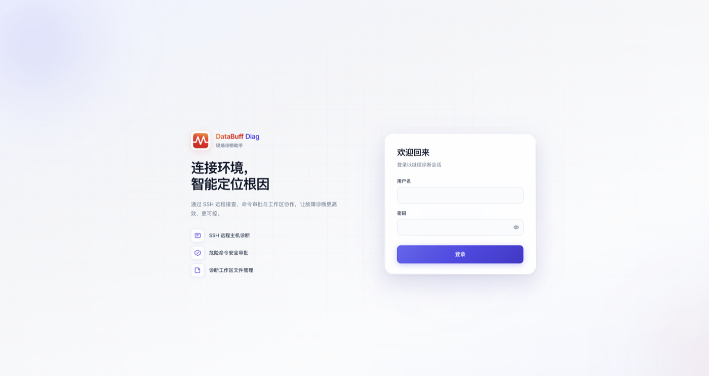
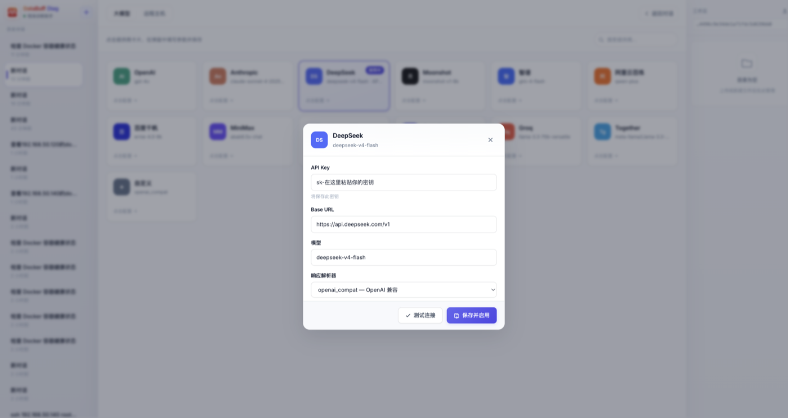
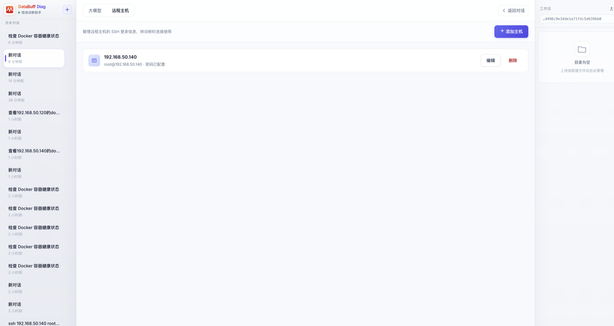
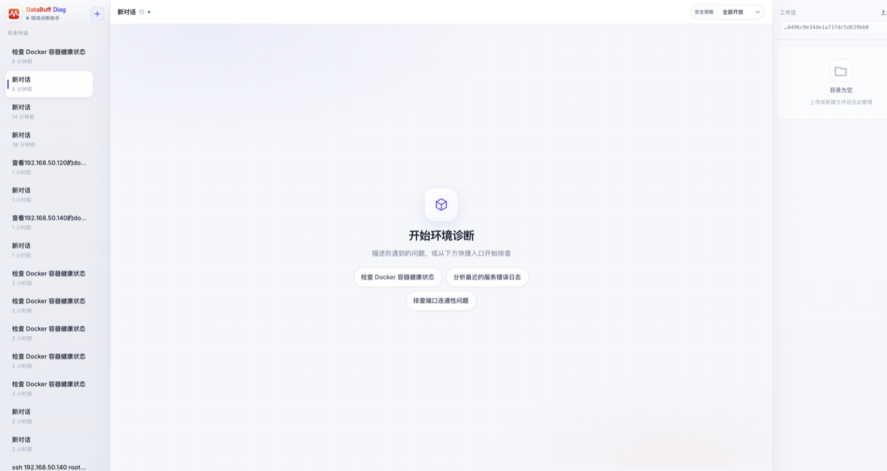

# databuff-diag

用浏览器对话，帮你排查服务器 / 容器环境问题。

---

## 开始之前

准备这三样：

| 需要 | 说明 |
|------|------|
| Mac、Linux 或 Windows 电脑 | Windows 10/11 均可 |
| 能上网 | 下载程序 + 调用大模型 |
| 大模型 API Key | 推荐 [DeepSeek](https://platform.deepseek.com) 注册后创建，免费额度够用 |

---

## 第一步：下载并启动

**① 下载**

打开 [Releases 下载页](https://github.com/databufflabs/databuff-diag/releases)，根据你的电脑选文件：

| 你的电脑 | 下载这个 |
|----------|----------|
| Mac（M1/M2/M3/M4 芯片） | `darwin_arm64` |
| Mac（Intel 芯片） | `darwin_amd64` |
| Linux 服务器（x86_64） | `linux_amd64` |
| Linux 服务器（ARM64） | `linux_arm64` |
| Windows（64 位） | `windows_amd64`（`.zip` 压缩包） |

Linux 发行包为静态链接，不依赖系统 glibc 版本（CentOS 7 / RHEL 8 等旧环境可直接运行）。

**② 解压**

**Mac / Linux：** 下载得到 `.tar.gz` 文件。打开「终端」（Mac 在「启动台 → 其他 → 终端」），执行：

```bash
cd ~/Downloads
tar -xzf databuff-diag_*.tar.gz
cd databuff-diag
```

**Windows：** 下载得到 `.zip` 文件，右键「全部解压缩」到任意文件夹（例如 `C:\`），会得到 `databuff-diag` 子目录。

**③ 启动**

**Mac / Linux：**

```bash
./databuff-diag serve
```

默认后台运行，关闭终端后服务仍继续。看到类似输出表示成功：

```
✓ databuff-diag 启动成功，访问 http://127.0.0.1:8787
  用户名: Admin
  密码:   Databuff@123
  日志: /Users/你/.databuff-diag/databuff-diag.log
  PID:  12345
```

查看日志：`tail -f ~/.databuff-diag/databuff-diag.log`  
停止服务：`kill $(cat ~/.databuff-diag/databuff-diag.pid)`

如需前台运行（关闭终端即停止）：

```bash
./databuff-diag serve --foreground
```

**Windows：**

```powershell
cd C:\databuff-diag
.\databuff-diag.exe serve
```

前台运行：

```powershell
.\databuff-diag.exe serve --foreground
```

---

## 第二步：登录

浏览器打开：**http://127.0.0.1:8787**

| 用户名 | 密码 |
|--------|------|
| Admin | Databuff@123 |

点 **登录**。



---

## 第三步：配置大模型

大模型相当于「大脑」，不配好无法对话。

1. 点左下角 **设置**
2. 确认在 **大模型** 这一页
3. 点击 **DeepSeek** 卡片（或你用的其他模型）
4. 在 **API Key** 框粘贴你的密钥（从 [platform.deepseek.com](https://platform.deepseek.com) → API Keys 创建）
5. 点 **测试连接**，显示成功
6. 点 **保存并启用**



---

## 第四步：添加远程机器（可选）

如果要排查**别的服务器**，需要先把 SSH 登录信息存进来。只查本机可跳过。

1. **设置** → **远程主机** → **添加主机**
2. 填写服务器 IP、用户名、密码
3. 保存



---

## 第五步：开始排障

点左上角 **返回对话**（或 **新对话**）。

在底部输入框用**普通话**描述你想查什么，点 **发送**：

```
帮我看看 192.168.50.140 这台机器 Docker 容器是否正常
```

也可以直接点页面上的快捷按钮（如「检查 Docker 容器健康状态」）。



AI 会自动执行命令并把结果告诉你。如果弹出「待批准」提示，点 **批准** 即可。

---

## 常见问题

| 问题 | 怎么办 |
|------|--------|
| 网页打不开 | 确认服务在运行：`cat ~/.databuff-diag/databuff-diag.pid` 或重新执行 `serve` |
| 登录不了 | 检查用户名 `Admin`、密码 `Databuff@123` |
| 对话没反应 | 回到 **设置 → 大模型**，确认已「保存并启用」且测试连接成功 |
| 连不上远程机器 | 检查 IP、用户名、密码是否正确 |

---

有问题欢迎提 [Issue](https://github.com/databufflabs/databuff-diag/issues)。
